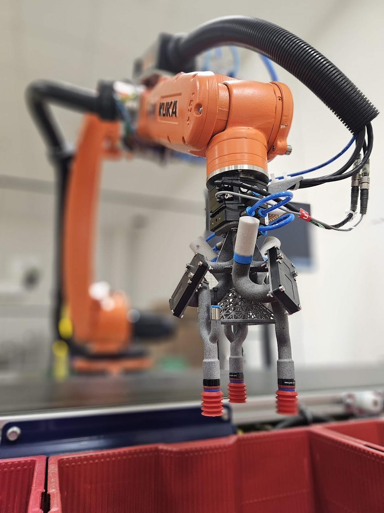

Některé fily jsou přesunuty jako deprecated, pokud bychom s nima dál chtěli pracovat, tak takto vypadá default cesta:
Ultralytics does not install pytorch with cuda by default

[](https://www.youtube.com/watch?v=zVX-cSrUM6I&ab_channel=Mik)


<details>
  <summary>Path</summary>

  ```
  D:.  
│   .gitignore  
│   requirements.txt  
│   rob_env_dependencies.ipynb  
│  
├───cv_pick_place  
│   │   cv_pick_place_main.py  
│   │   extrinsic_calibration.py  
│   │   extrinsic_test.py  
│   │   mult_packets_pick_place.py  
│   │  
│   ├───config  
│   │       conveyor_points.json  
│   │       D435_camera_config.json  
│   │       D435_camera_config_defaults.json  
│   │       robot_config.json  
│   │       robot_positions.json  
│   │  
│   └───robot_cell  
│       │   graphics_functions.py  
│       │  
│       ├───control  
│       │   │   control_state_machine.py  
│       │   │   robot_communication.py  
│       │   │   robot_control.py  
│       │   │   __init__.py  
│       │   │  
│       │   └───__pycache__  
│       │           control_state_machine.cpython-39.pyc  
│       │           fake_robot_control.cpython-39.pyc  
│       │           pick_place_demos.cpython-39.pyc  
│       │           robot_communication.cpython-39.pyc  
│       │           robot_control.cpython-39.pyc  
│       │           __init__.cpython-39.pyc  
│       │  
│       ├───detection  
│       │   │   apriltag_detection.py  
│       │   │   market_items_detector.py  
│       │   │   packet_detector.py  
│       │   │   realsense_depth.py  
│       │   │   threshold_detector.py  
│       │   │   __init__.py  
│       │   │  
│       │   └───__pycache__  
│       │           apriltag_detection.cpython-39.pyc  
│       │           packet_detector.cpython-39.pyc  
│       │           realsense_depth.cpython-39.pyc  
│       │           threshold_detector.cpython-39.pyc  
│       │           __init__.cpython-39.pyc  
│       │  
│       └───packet  
│           │   centroidtracker.py  
│           │   grip_position_estimation.py  
│           │   item_tracker.py  
│           │   packettracker.py  
│           │   packet_object.py  
│           │   point_cloud_viz.py  
│           │   __init__.py  
│           │  
│           └───__pycache__  
│                   centroidtracker.cpython-39.pyc  
│                   grip_position_estimation.cpython-39.pyc  
│                   item_object.cpython-39.pyc  
│                   item_tracker.cpython-39.pyc  
│                   packettracker.cpython-39.pyc  
│                   packet_object.cpython-39.pyc  
│                   point_cloud_viz.cpython-39.pyc  
│                   __init__.cpython-39.pyc  
│  
├───PLC_Prog  
│       KUKA Cybertech R1 17-6-2021_V17.ap17  
│  
└───Scripts  
        camera_playback.py  
        camera_record.py  
        compressed_recording_playback.py  
        packet_auto_label.py  
        pick_place_control.py  
        realsense_depth.py  
        realsense_speed_test.py  
        recording_compress.py  
        robot_camera_pose.json  
        Robot_Camera_pose.py  
  ```
</details>


